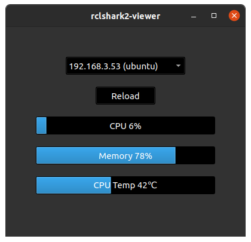

# rclshark​2 :turtle::shark:

latest : [v2.0.0](https://github.com/Ar-Ray-code/rclshark2/releases/tag/v2.0.0)

[解説（Zenn）](https://zenn.dev/array/articles/9fd8cb5941bb94)

[紹介ページ（github.io）](https://ar-ray-code.github.io/05_rclshark/index.html)

Monitor the status of computers on a network using the DDS function of ROS2.


## Requirements

- ROS2 foxy-base [Installation](https://docs.ros.org/en/foxy/Installation.html), galactic, rolling
- python3-colcon-common-extensions
- python3-psutil

## Support

- Ubuntu 20.04 (x86_64, Armv8)
- Raspberry Pi OS (aarch64) 
- <del>Windows 11 (x86_64) 


## 1. rclshark​ :turtle: :shark:

Repository : https://github.com/Ar-Ray-code/rclshark2

rclshark is an IP address display system that takes advantage of the DDS publishing nature of the ros2 node to the local network, and can recognize any device with ROS2 installed.
rclshark is also a service server, and has a function to Repositoryrt computer status using psutil.

<!-- See [rclshark-smi](https://github.com/Ar-Ray-code/rclshark#rclshark-smi-turtle-shark) for details. -->

---

### Installation

#### Using install script (Automatic start)

Install ROS2-base beforehand.

If you want to know how to install ROS-Foxy , please check [ROS2-Foxy-Installation](https://docs.ros.org/en/foxy/Installation/Ubuntu-Install-Debians.html).

```bash
git clone https://github.com/Ar-Ray-code/rclshark2
cd rclshark2
sudo bash install.bash /opt/ros/foxy
```


### rclshark2 quick check

Since rclshark2 is an application that uses the basic functions of ROS2, you can find it with the ros2 command.

```bash
source /opt/rclshark2_ws/install/setup.bash
ros2 topic list | grep rsk
> /rskc0a80b0f_ubuntu_i9rtx_pub
```


Now you can safely forget your IP address.:wink:


## rclshark2-viewer

[rclshark2-viewer](https://github.com/Ar-Ray-code/rclshark-viewer) is a GUI tool that replaces rclshark-smi.

GitHub : [Ar-Ray-code/rclshark2-viewer](https://github.com/Ar-Ray-code/rclshark-viewer)




## [rclshark (old)](https://github.com/Ar-Ray-code/rclshark) Documents

- Zenn : https://zenn.dev/array/articles/9fd8cb5941bb94
- DockerHub : https://hub.docker.com/r/ray255ar/rclshark
- Computer_msgs : https://github.com/Ar-Ray-code/computer_msgs
- rclshark-smi : https://github.com/Ar-Ray-code/rclshark-smi
- Website : https://ar-ray-code.github.io/05_rclshark


## About author

- author : [Ar-Ray](https://github.com/Ar-Ray-code)
- [Twitter](https://twitter.com/Ray255Ar)

